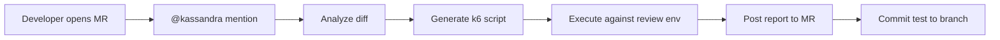

# 🔮 Kassandra

**Performance testing that happens automatically on every merge request.**

---

## The Problem

Performance testing is universally acknowledged as important but rarely done consistently. This isn't a tooling problem — k6 is excellent and free. It's a **friction problem**. Writing load tests requires understanding the code changes, choosing appropriate load profiles, setting meaningful thresholds, and interpreting results. That takes time nobody has, so it gets skipped. Performance regressions ship to production and become incidents.

## The Solution

Kassandra is a GitLab AI agent that triggers on merge request events. It reads your code diffs, generates intelligent k6 load test scripts, executes them against your review environment, and posts a detailed performance report — all without any manual intervention. No configuration required to start, but fully customizable via `AGENTS.md`.

## How It Works



### Step by Step

1. **Trigger** — A developer opens a merge request or mentions `@kassandra`
2. **Context Gathering** — Kassandra reads the MR diff, discovers existing tests, checks `AGENTS.md` for SLOs
3. **Diff Analysis** — Identifies new/modified API endpoints, classifies each by type (REST, batch, auth, analytics)
4. **Test Generation** — Produces a k6 script with the right executor, thresholds, and load profile for each endpoint type
5. **Execution** — Runs the generated test against the review environment with a smoke test first, then full load
6. **Reporting** — Posts a structured performance report to the MR with metrics, analysis, and actionable observations

## Example Output

When Kassandra runs on a merge request that adds a batch endpoint, it posts:

> ## 🔮 Kassandra Performance Report
>
> **MR:** !42 | **Branch:** `feature/batch-recommendations` → `main`
> **Environment:** `https://review-42.example.com` | **Generated:** 2026-03-10
>
> ### Summary
>
> | Metric | Value | Threshold | Status |
> |--------|-------|-----------|--------|
> | p95 Latency | 1,245ms | < 5,000ms | ✅ |
> | p99 Latency | 2,891ms | < 5,000ms | ✅ |
> | Error Rate | 0.2% | < 1% | ✅ |
> | Requests/sec | 9.8 | — | ℹ️ |
>
> ### What I Tested
>
> **New Endpoints:**
> - `POST /api/pizza/batch` — Batch recommendation (added in this MR)
>   - Executor: `constant-arrival-rate` at 10 req/s
>   - Rationale: Batch endpoint — throughput stability matters more than user count
>
> **Baseline Regression:**
> - `GET /api/ingredients` — No degradation (p95: 145ms → 152ms, +4.8%)
> - `POST /api/pizza` — No degradation (p95: 230ms → 241ms, +4.7%)
>
> ### Decisions Made
>
> | Decision | Choice | Why |
> |----------|--------|-----|
> | Executor | `constant-arrival-rate` | Batch endpoint — fixed arrival rate tests throughput |
> | Load profile | 10 req/s for 2min | Review env; conservative |
> | p95 threshold | 5000ms | Batch processing; relaxed per AGENTS.md SLO |

## What Makes Kassandra Different

| | Template Generators | Manual Testing | Kassandra |
|---|---|---|---|
| **Reads your code** | ❌ Generic templates | N/A | ✅ Analyzes the actual diff |
| **Chooses executor** | ❌ One-size-fits-all | ✅ Human judgment | ✅ Endpoint-type decision table |
| **Sets thresholds** | ❌ Arbitrary defaults | ✅ Human judgment | ✅ Derives from AGENTS.md SLOs |
| **Runs automatically** | ❌ Manual trigger | ❌ Manual process | ✅ On every MR |
| **Explains decisions** | ❌ | ✅ | ✅ Every choice documented |
| **Matches conventions** | ❌ | ✅ | ✅ Discovers and follows existing test patterns |
| **Baseline regression** | ❌ | Sometimes | ✅ Always tests existing endpoints |

## Configuration

Kassandra works with zero configuration, but you can customize it via `AGENTS.md` in your repo root:

```markdown
## Performance Testing (Kassandra)

### SLOs
- Default: p95 < 2000ms, error rate < 0.5%
- Auth endpoints: p95 < 1000ms
- Batch endpoints: p95 < 5000ms

### Load Profiles
- Review environment: max 50 VUs, 2-3 min duration

### Critical Paths
- /api/users/token/login
- /api/pizza

### Excluded Paths
- /api/status/*
- /metrics

### Review Environment
- Pattern: https://${CI_ENVIRONMENT_SLUG}.review.example.com
- Auth: username=default, password=1234

### Test Conventions
- Directory: tests/k6/
- Import auth from tests/k6/helpers/auth.js
```

## Conversational Follow-up

Kassandra responds to comments on the MR:

- **"Run again with 200 VUs"** → Re-runs with modified VU count
- **"Ignore the auth endpoint"** → Excludes and re-runs
- **"Raise threshold to 5s"** → Adjusts and re-runs
- **"Why constant-arrival-rate?"** → Explains executor choice with reasoning

## Safety Model

**Sandboxed Execution.** k6 runs inside a CI container with network access limited to the review environment, which is ephemeral and contains no production data. Kassandra cannot access production systems, databases, or secrets. Generated test scripts are committed to the branch and fully auditable.

**Minimal Permissions.** The Kassandra service account operates with Developer role — it can read code, run commands in CI, and post MR notes. It cannot merge, delete branches, modify CI/CD variables, or access project secrets. Every tool call is logged for auditability.

## Local Development

### Prerequisites

- Python 3.11+ with [uv](https://github.com/astral-sh/uv)
- [k6](https://k6.io/) for running load tests
- (Optional) Local LLM server for simulator testing

### Setup

```bash
uv venv .venv
source .venv/bin/activate
uv pip install openai anthropic httpx rich
```

### Run the Simulator

```bash
# With local MLX model (start server first)
uv run python -m simulator --sample 01-add-batch-endpoint --verbose

# With Anthropic API
KASSANDRA_USE_ANTHROPIC=1 uv run python -m simulator --sample 01-add-batch-endpoint

# Dry run (generate but don't execute k6)
uv run python -m simulator --sample 01-add-batch-endpoint --dry-run
```

### Evaluate Scripts

```bash
# Check all expected scripts compile and meet quality bar
uv run python -m simulator.evaluate --check-all
```

## Built With

- **[GitLab Duo Agent Platform](https://docs.gitlab.com/ee/user/duo_workflow/)** — Agent orchestration and tool execution
- **[Anthropic Claude](https://www.anthropic.com/)** — Language model powering diff analysis and test generation
- **[Grafana k6](https://k6.io/)** — Load testing engine
- **[QuickPizza](https://quickpizza.grafana.com/)** — Demo application for development and testing

## Project Structure

```
├── .gitlab/duo/           # Agent and flow YAML configs
├── prompts/               # System prompt (the agent's brain)
├── samples/               # Sample diffs, MR contexts, gold-standard scripts
├── simulator/             # Local testing harness
├── tests/k6/              # Pre-existing baseline k6 tests
├── AGENTS.md              # Project configuration for AI agents
└── README.md
```

## License

MIT — see [LICENSE](LICENSE).

---

> 🔮 *Kassandra sees the performance problems you won't — until production.*
